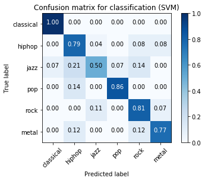

# Welcome to my music genre classification project
* https://github.com/leemgs/music-genre-class-f1-score (GitHub Repo)

I established a below system environment for development:
 * Ubuntu 18.04 (LTS x86_64)
 * Anaconda3 (20200210)
   * Jupyter 1.0
   * Python 3.6
   * Tensorflow 2.0.1
   * Keras 2.3.1


This repository consists of development code that classifies music genre according to the following six genres: 
* Dataset: (1)Classical, (2)Hiphop, (3)Jazz, (4)Metal, (5)Pop, and (6)Rock


### Features used: 
* FFT (Fast Fourier Transform):
  * F1-score: ~ 50%.

* MFCC (Mel-Frequency Cepstral Coefficients):
  * F1-score: ~ 78%.


### Choice of classifier:
* Classical Machine Learning:
  * Logistic Regression Classifier (Logistic)
  * KNeighbors Classifier (KNN)
  * Support Vector Machine (SVM)
* Deep Learning: (**Caution**: Use lots of Nvidia GPUs because a training time is too long.)
  * FFNN
    * F1-score: ~ 71%.
  * CNN
    * F1-score: ~ 85%.
  * Pre-trained network: Desenet, Efficientnet

## How to use:

* Install (Ana)conda environment on Ubuntu 18.04 LTS (x86-64)
```bash
invain@u1804$ curl -O https://repo.anaconda.com/archive/Anaconda3-2020.02-Linux-x86_64.sh
invain@u1804$ bash Anaconda3-2020.02-Linux-x86_64.sh
invain@u1804$ source ~/.bashrc
invain@u1804$ conda create -n python36 python=3.6
invain@u1804$ conda info --env
invain@u1804$ conda activate python36
(python36)$ conda install jupyter notebook
(python36)$ jupyter-notebook --debug

```

* Download a dataset for a training: 
  * Get the dataset from [https://canvas.skku.edu](https://canvas.skku.edu) - **SFC5015_41** - Week06 (exec-06-music-class.zip)
    * You can also get the GTZAN dataset (*.wav) at http://opihi.cs.uvic.ca/sound/genres.tar.gz
  * Extract into a suitable directory: WORK_DIR (e.g., /work2/final/music-genre-class-f1-score/genres.backup/)

* Execute the "**run.sh**" file to do a feature task with FFT & MFCC:
  * Run the "extract-features-FFT.py" file on each dataset sub-directory of WORK_DIR.
  * Run the "extract-features-MFCC.py" file on each dataset sub-directory of WORK_DIR.

* Train and Classify with the "**"train-classify.ipynb"**" file
  * Run train-classify.ipynb with an interactive Jupyter-notebook software.
  * Then, calculate a precision, recall, and F1-score for performance evaluation.


## Evaluation
The experimental result is as follows. 

* Classification Report with a precision, recall, and F1-score with optimized MFCC+SVM for 6 genres.

```bash
******USING MFCC******
                  . . . Middle Omission . . . 
  
######## CLASSIFICATION REPORT with SVM (Support Vector Machin)########
svm accuracy (test set)= 0.78
svm confusion matrix:
[[24  0  0  0  0  0]
 [ 0 19  1  0  2  2]
 [ 2  6 14  2  4  0]
 [ 0  3  0 18  0  0]
 [ 0  0  3  0 22  2]
 [ 0  3  0  0  3 20]]
              precision    recall  f1-score   support

   classical       0.92      1.00      0.96        24
      hiphop       0.61      0.79      0.69        24
        jazz       0.78      0.50      0.61        28
         pop       0.90      0.86      0.88        21
        rock       0.71      0.81      0.76        27
       metal       0.83      0.77      0.80        26

   micro avg       0.78      0.78      0.78       150
   macro avg       0.79      0.79      0.78       150
weighted avg       0.79      0.78      0.78       150

                ... Below Omission ...
```

* Confusion Matrix

 
## Reference

* [Building Machine Learning Systems with Python](http://totoharyanto.staff.ipb.ac.id/files/2012/10/Building-Machine-Learning-Systems-with-Python-Richert-Coelho.pdf)
  * ISBN 978-1-78216-140-0 (290 pages)
  * Author: Willi Richert and Luis Pedro Coelho
  * Publisher: PACKT Publishing (www.packpub.com)
  * Date: 2013.02.15


* [Music genre classification using machine learning technique](https://www.groundai.com/project/music-genre-classification-using-machine-learning-techniques/1)
  * Date: 2018.04.03
  * Network model: VGG-16


* [Music genre classification with CNN](https://github.com/Ritesh313/Music-genre-classificartion/tree/master/MusicGenre)
  * Date: 2020.01.12
  * Network model: Densenet, Efficientnet
